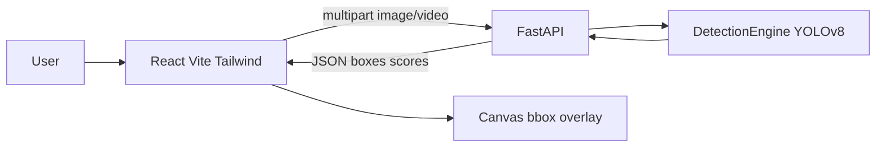

# Phase 12 - Portfolio Packaging

## Architecture

## Highlights for LinkedIn / resume

- End-to-end object detection system: dataset → train/eval → inference engine → FastAPI → React UI
- YOLOv8n fine-tuned on COCO128 (local CPU); best checkpoint selected by mAP@0.5
- Image, video (frame-sampled), and webcam capture modes
- Production-oriented packaging: CORS, validation, health checks, deploy configs for Vercel + Railway

## Demo script

1. Start backend: `cd backend && uvicorn app.main:app --reload --port 8000`
2. Start frontend: `cd frontend && npm run dev`
3. Upload a photo → Run detection → show boxes + confidence list
4. Optional: short video or webcam capture

## Screenshots / artifacts

- Class histogram: `docs/reports/phase2_class_histogram.png`
- Sample annotated inference: `docs/reports/phase7_sample_annotated.jpg`
- Metrics: `docs/reports/phase5_eval_report.json`, `docs/reports/phase6_improve_report.json`

## GitHub README

Root `README.md` is the portfolio entrypoint (setup, stack, phase status, demo).

## LinkedIn post draft

See `docs/LINKEDIN_POST.md`.
